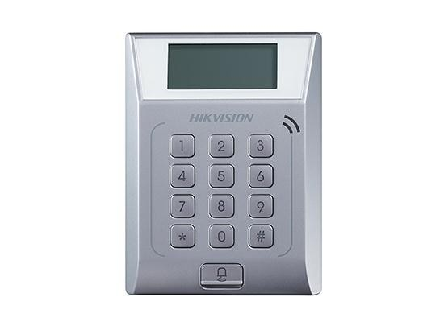

# [Lecteur autonome HIKVISION](readme.md)

## Description

C'est un lecteur autonome à code et à badge

## Codes

`* + 0 + #` puis `12345`

## Informations utiles

* Il ne dispose pas de sortie NO sur les anciennes  versions

## Disactiver le cryptage M1

Dans IVMS aller dans :

1. Controle d'accès
2. Fonctions avancées
3. Plus de paramètres
4. Encryotion M1
5. Désectiver l'option et sauvegarder