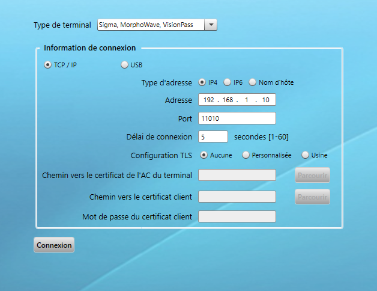

# [Morpho Access](readme.md)

## Lecteur Sigma Lite

Le lecteur sigma lite dispose d'un lecteur de badge et d'un capteur d'empreintes.

## Activation du lecteur

1. Alimenter le lecteur en POE
2. Lancer le logiciel [MBTB](https://www.biotime-technology.com/wxcvbn/MBTB_4.6.13.zip).
3. Lancer le logiciel MBTB
4. Sasir l'adresse IP par défaut 
5. Cocher ``Usine`` dans la section ``Configuration TLS`` puis ``Connexion`` pour activer le lecteur. Si cela ne marche pas il faut déconnecter le lecteur et le rebrancher
6. Si c'est appuyez sur ``Fichier``> ``Déconencter le termnal courant``
7. Ensuite cocher ``Aucune`` puis ``Connexion``. 
8. Activer le serveur web
   1. Rechercher ``server`` puis mettre ``comm_channels._state.web_server``
   2. mettre local à 1
   3. 

## Se connecter à l'interface web

1. Se connecter sur l'adresse IP 192.168.1.10 via un navigateur
2. Les identifiants sont Admin/12345

## Configuration weigand

1. Aller au menu ``Paramètres du terminal``>``Weigand``
2. Choisir le format de badges par exemple le 26 bits
3. Activer les sorties weigand 

## Configurer les évènements

1. Aller sur ``Configurations de controle``>``Evenement``
2. Choisir les évènements à envoyer au controlleur tel que les ``Evénement succès de contrôle utilisateur``

## Configurer le type de carte

1. Aller sur ``Configurations de controle``>``carte sans contact``
2. dans la partie ``Encoder le profil`` et ``Lire le profil``

## Sauvegarder et charger la configuration

La configuration le prend pas compte la base de donnée d'utilisateurs.

1. ``Sauvegarder`` pour enregistrer la configuration locale
2. Charger pour charger une configuration
3. 

## Logiciel

Il faut le logiciel morpho manager pour pouvoir gérer facilement les utilisateurs.

## Ajouter un utilisateur

Il faut utiliser les numéros de cartes générés sur winpak 

