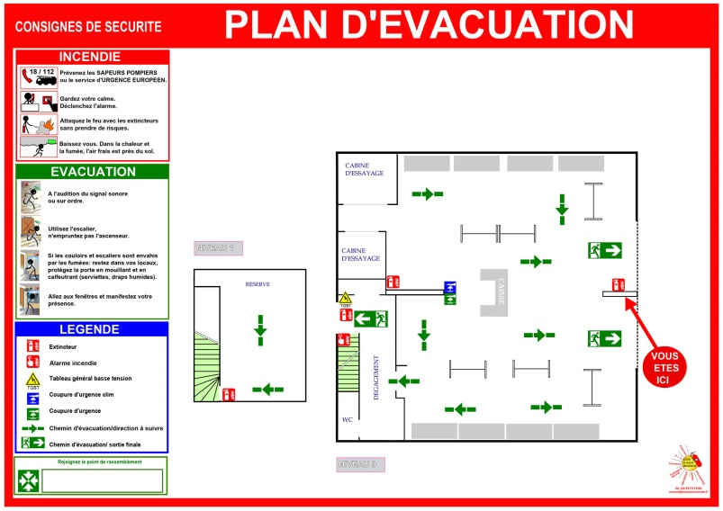

# [Plan d'évacuation](readme.md)

## Plan

### Règles pratiques

* À chaque étage : au moins un plan d’évacuation par niveau.
* À chaque issue de secours ou escalier : placer un plan avant d’y accéder.
* Dans les zones à forte fréquentation : un plan visible tous les 15 à 20 m de parcours.
* Pour les bâtiments complexes (hôtels, bureaux, centres commerciaux) : prévoir un plan par zone afin qu’il soit toujours visible depuis un point de passage.

### Caractériqtiques du plan

* Placé à hauteur des yeux (~1,50 m).
* Résistant au feu et aux dégradations.
* Inclure :
  * Vous êtes ici ✅
  * Chemins d’évacuation et issues.
  * Points de rassemblement.
  * Moyens de lutte contre l’incendie (extincteurs, alarmes)

### Bonnes pratiques

* Faire des excercices réguliers
* Former régulièrement le personnel ou les occupants.
* Organiser au moins un exercice d’évacuation par an.
* Mettre à jour les consignes à chaque modification du bâtiment ou des procédures.
* Vérifier la visibilité (pas derrière un meuble ou une porte).